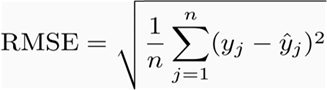
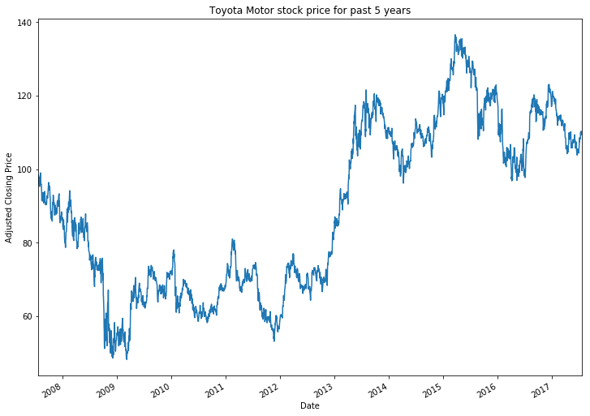

# Machine Learning Engineer Nanodegree
## Capstone Project
Yuichi Hagio
July 30, 2017

## I. Definition

Stock Price Predictor

### Project Overview

Machine learning can be great at predicting the future from the historical data. 
A machine-learning algorithm can be more accurate on the prediction 
than conventional trading strategies based on rules set by humans.

Investment firms have adopted machine learning in recent years rapidly, 
even some firms have started replacing humans with A.I. to make investment decisions.

In this project, simply I experimented to use Deep Learning to predict stock prices.

### Problem Statement

There is no easy way to predict stock prices accurately 
and no method is perfect since there are many factors
that can affect the stock prices (i.e. people's emotion, natural disasters, etc), 
but I believe that I can predict whether the closing price goes up or down by applying machine learning techniques and algorithm from the historical data set for this project. 

### Metrics(TODO)

To determine how accurate the prediction is, we analyze the difference between 
the predicted and the actual adjusted close price. Smaller the difference indicates better 
accuracy. 

I can use Root Mean Squared Error (RMSE) 
as a metric to determine the accuracy of the prediction. 
It is a commonly used general purpose quality estimator.

Also, by visualizing the predicted price and the actual price with a plot or a graph, it can tell how close the 
prediction is clearly.

**Why I use RMSE for the metric?**

There are many metrics for accuracy like R2, MAE, etc.

I chose to use RMSE because it explicitly shows the deviation of the prediction for continuous variables
from the actual dataset. So, it fits in this project to measure the accuracy.

It measures the average magnitude of the error and ranges from 0 to infinity.
The errors are squared and then they are averaged,
RMSE gives a relatively high weight to large errors, and the errors in stock price prediction
can be critical, so it is appropriate metric to penalize the large errors.

## II. Analysis

### Data Exploration

There are several data sources for the historical stock price data.
I can use yahoo finance data set (`.csv` format) for this project.

**_How different is adjusted close price from close price?_**

Adjusted close price is the price of the stock at the closing of the trading adjusted with the dividends, and the close price is the price of the stock at the closing of the trading. Both values can be same, or not.

Data set is daily hisorical prices for 10 years (Jul 24, 2007 - Jul 24, 2017),
which is 2518 data set for each stock (2518 days of trading).

80% of the data set can be used for training. 
20% of the data set can be used for testing.

Download the CSV file for each (GE, S&P 500, Microsoft, Apple, Toyota)

- GE: https://finance.yahoo.com/quote/GE/history?p=GE
- Microsoft: https://finance.yahoo.com/quote/MSFT/history?p=MSFT
- Apple: https://finance.yahoo.com/quote/AAPL/history?p=AAPL
- Toyota: https://finance.yahoo.com/quote/TM/history?p=TM
- S&P 500: https://finance.yahoo.com/quote/%5EGSPC/history?p=%5EGSPC

**_Example data from csv_**

The data includes following properties:

| Date       | Open       | High       | Low	    | Close      | Adj Close | Volume  |
| ---------- | ---------- | ---------- | ---------- | ---------- | --------- | ------- |
| 2007-07-24 | 123.779999 | 123.779999 | 122.309998	| 122.489998 | 98.390572 | 418000  |
| 2007-07-25 | 123.389999 | 123.410004 | 121.500000	| 122.290001 | 98.229897 | 557900  |
| 2007-07-26 | 122.320000 | 122.349998 | 117.050003	| 119.199997 | 95.747864 | 1258500 |

The data set is straight forward and there is no missing value in each column.

### Exploratory Visualization

**Toyota Motor data**

Plot of the dataset from Toyota Motor for Adjusted Close Price for 10 years trading period.

### Algorithms and Techniques (TODO)

Linear Regression

Long Short Term Memory (LSTM)

80% of the data set can be used for training. 
20% of the data set can be used for testing.

TODO: parameters, default variables
TODO: results (Stats and Visualization)
Mean squared error (MSE)
Root mean squared error (RMSE)

In this section, you will need to discuss the algorithms and techniques you intend to use for solving the problem. You should justify the use of each one based on the characteristics of the problem and the problem domain. Questions to ask yourself when writing this section:
- _Are the algorithms you will use, including any default variables/parameters in the project clearly defined?_
- _Are the techniques to be used thoroughly discussed and justified?_
- _Is it made clear how the input data or datasets will be handled by the algorithms and techniques chosen?_

### Benchmark (TODO)

My benchmark model is Linear Regression.

In this section, you will need to provide a clearly defined benchmark result or threshold for comparing across performances obtained by your solution. The reasoning behind the benchmark (in the case where it is not an established result) should be discussed. Questions to ask yourself when writing this section:
- _Has some result or value been provided that acts as a benchmark for measuring performance?_
- _Is it clear how this result or value was obtained (whether by data or by hypothesis)?_

## III. Methodology

### Data Preprocessing (TODO)

Since it simply tries to predicts the **Adjusted Close** Price from the past data, I believe
there is no need for feature engineering.

So I take the **Adj Close** column from the dataset.

In this section, all of your preprocessing steps will need to be clearly documented, if any were necessary. From the previous section, any of the abnormalities or characteristics that you identified about the dataset will be addressed and corrected here. Questions to ask yourself when writing this section:
- _If the algorithms chosen require preprocessing steps like feature selection or feature transformations, have they been properly documented?_
- _Based on the **Data Exploration** section, if there were abnormalities or characteristics that needed to be addressed, have they been properly corrected?_
- _If no preprocessing is needed, has it been made clear why?_

### Implementation (TODO)

In this section, the process for which metrics, algorithms, and techniques that you implemented for the given data will need to be clearly documented. It should be abundantly clear how the implementation was carried out, and discussion should be made regarding any complications that occurred during this process. Questions to ask yourself when writing this section:
- _Is it made clear how the algorithms and techniques were implemented with the given datasets or input data?_
- _Were there any complications with the original metrics or techniques that required changing prior to acquiring a solution?_
- _Was there any part of the coding process (e.g., writing complicated functions) that should be documented?_

### Refinement (TODO)

In this section, you will need to discuss the process of improvement you made upon the algorithms and techniques you used in your implementation. For example, adjusting parameters for certain models to acquire improved solutions would fall under the refinement category. Your initial and final solutions should be reported, as well as any significant intermediate results as necessary. Questions to ask yourself when writing this section:
- _Has an initial solution been found and clearly reported?_
- _Is the process of improvement clearly documented, such as what techniques were used?_
- _Are intermediate and final solutions clearly reported as the process is improved?_

## IV. Results (TODO)

### Model Evaluation and Validation (TODO)
In this section, the final model and any supporting qualities should be evaluated in detail. It should be clear how the final model was derived and why this model was chosen. In addition, some type of analysis should be used to validate the robustness of this model and its solution, such as manipulating the input data or environment to see how the model’s solution is affected (this is called sensitivity analysis). Questions to ask yourself when writing this section:
- _Is the final model reasonable and aligning with solution expectations? Are the final parameters of the model appropriate?_
- _Has the final model been tested with various inputs to evaluate whether the model generalizes well to unseen data?_
- _Is the model robust enough for the problem? Do small perturbations (changes) in training data or the input space greatly affect the results?_
- _Can results found from the model be trusted?_

### Justification (TODO)
In this section, your model’s final solution and its results should be compared to the benchmark you established earlier in the project using some type of statistical analysis. You should also justify whether these results and the solution are significant enough to have solved the problem posed in the project. Questions to ask yourself when writing this section:
- _Are the final results found stronger than the benchmark result reported earlier?_
- _Have you thoroughly analyzed and discussed the final solution?_
- _Is the final solution significant enough to have solved the problem?_

## V. Conclusion (TODO)

### Free-Form Visualization (TODO)
In this section, you will need to provide some form of visualization that emphasizes an important quality about the project. It is much more free-form, but should reasonably support a significant result or characteristic about the problem that you want to discuss. Questions to ask yourself when writing this section:
- _Have you visualized a relevant or important quality about the problem, dataset, input data, or results?_
- _Is the visualization thoroughly analyzed and discussed?_
- _If a plot is provided, are the axes, title, and datum clearly defined?_

### Reflection (TODO)
In this section, you will summarize the entire end-to-end problem solution and discuss one or two particular aspects of the project you found interesting or difficult. You are expected to reflect on the project as a whole to show that you have a firm understanding of the entire process employed in your work. Questions to ask yourself when writing this section:
- _Have you thoroughly summarized the entire process you used for this project?_
- _Were there any interesting aspects of the project?_
- _Were there any difficult aspects of the project?_
- _Does the final model and solution fit your expectations for the problem, and should it be used in a general setting to solve these types of problems?_

### Improvement (TODO)
In this section, you will need to provide discussion as to how one aspect of the implementation you designed could be improved. As an example, consider ways your implementation can be made more general, and what would need to be modified. You do not need to make this improvement, but the potential solutions resulting from these changes are considered and compared/contrasted to your current solution. Questions to ask yourself when writing this section:
- _Are there further improvements that could be made on the algorithms or techniques you used in this project?_
- _Were there algorithms or techniques you researched that you did not know how to implement, but would consider using if you knew how?_
- _If you used your final solution as the new benchmark, do you think an even better solution exists?_

-----------

**Before submitting, ask yourself. . .**

- Does the project report you’ve written follow a well-organized structure similar to that of the project template?
- Is each section (particularly **Analysis** and **Methodology**) written in a clear, concise and specific fashion? Are there any ambiguous terms or phrases that need clarification?
- Would the intended audience of your project be able to understand your analysis, methods, and results?
- Have you properly proof-read your project report to assure there are minimal grammatical and spelling mistakes?
- Are all the resources used for this project correctly cited and referenced?
- Is the code that implements your solution easily readable and properly commented?
- Does the code execute without error and produce results similar to those reported?
