# Machine Learning Engineer Nanodegree
## Capstone Project
Yuichi Hagio
July 30, 2017

## I. Definition

Stock Price Predictor

### Project Overview

Machine learning can be great at predicting the future from the historical data. 
A machine-learning algorithm can be more accurate on the prediction 
than conventional trading strategies based on rules set by humans.

Investment firms have adopted machine learning in recent years rapidly, 
even some firms have started replacing humans with A.I. to make investment decisions.

In this project, simply I experimented to use Deep Learning to predict stock prices.

### Problem Statement

There is no easy way to predict stock prices accurately 
and no method is perfect since there are many factors
that can affect the stock prices (i.e. people's emotion, natural disasters, etc), 
but I believe that I can predict whether the closing price goes up or down by applying machine learning techniques and algorithm from the historical data set for this project. 


### Metrics

To determine how accurate the prediction is, we analyze the difference between 
the predicted and the actual adjusted close price. Smaller the difference indicates better 
accuracy. 

I chose both Mean Squared Error (MSE) and Root Mean Squared Error (RMSE) 
as a metric to determine the accuracy of the prediction. 
It is a commonly used general purpose quality estimator.

Also, by visualizing the predicted price and the actual price with a plot or a graph, it can tell how close the 
prediction is clearly.


**Why I use MSE/RMSE for the metric?**

There are many metrics for accuracy like R2, MAE, etc.

I chose to use MSE/RMSE because they explicitly show the deviation of the prediction for continuous variables
from the actual dataset. So, they fit in this project to measure the accuracy.


It measures the average magnitude of the error and ranges from 0 to infinity.
The errors are squared and then they are averaged,
MSE/RMSE gives a relatively high weight to large errors, and the errors in stock price prediction
can be critical, so it is appropriate metric to penalize the large errors.


## II. Analysis

### Data Exploration

There are several data sources for the historical stock price data.
I can use yahoo finance data set (`.csv` format) for this project.

**_How different is adjusted close price from close price?_**

Adjusted close price is the price of the stock at the closing of the trading adjusted with the dividends, and the close price is the price of the stock at the closing of the trading. Both values can be same, or not.

Data set is daily hisorical prices for 10 years (Jul 24, 2007 - Jul 24, 2017),
which is 2518 dataset for each stock (2518 days of trading).

90% of the data set were used for training.<br />
10% of the data set were used for testing.

Download the CSV file for each (GE, S&P 500, Microsoft, Apple, Toyota)

- GE: https://finance.yahoo.com/quote/GE/history?p=GE
- Microsoft: https://finance.yahoo.com/quote/MSFT/history?p=MSFT
- Apple: https://finance.yahoo.com/quote/AAPL/history?p=AAPL
- Toyota: https://finance.yahoo.com/quote/TM/history?p=TM
- S&P 500: https://finance.yahoo.com/quote/%5EGSPC/history?p=%5EGSPC


**_Example data from csv_**

The data includes following properties:

| Date       | Open       | High       | Low	    | Close      | Adj Close | Volume  |
| ---------- | ---------- | ---------- | ---------- | ---------- | --------- | ------- |
| 2007-07-24 | 123.779999 | 123.779999 | 122.309998	| 122.489998 | 98.390572 | 418000  |
| 2007-07-25 | 123.389999 | 123.410004 | 121.500000	| 122.290001 | 98.229897 | 557900  |
| 2007-07-26 | 122.320000 | 122.349998 | 117.050003	| 119.199997 | 95.747864 | 1258500 |

The data set is straight forward and there is no missing value in each column.


### Exploratory Visualization

**Toyota Motor data**

Plot of the dataset from Toyota Motor for Adjusted Close Price for 10 years trading period.


### Algorithms and Techniques

From the data set of yahoo finance. Predict the closing price of a target day based on the 
historical data up to the previous day of the target day.

I try to use a kind of Recurrent Neural Network (RNN), called Long Short Term Memory (LSTM) from Keras library for the solution model. RNN is a deep learning algorithm that has a "memory"
to remember / store the information about what has been calculated previously.

LSTM networks have memory blocks that are connected through layers, and it can choose what it remembers and can decide to forget, so it can adjust how much of memory it should pass to next layer.

Since I use the time series of data of stock prices and try to predict the price,
LSTM looks good fits for this project.

### Benchmark

As a baseline benchmark model, I used **Linear Regression** model.

**_Why I chose Linear Regression as a baseline benchmark model?_**

Linear Regression is simple and fairly rigid approximeter to be used as a baseline algorithm.
Since I do not want to set the baseline model to be complicated, slow, or requiring a sort of data transformation
to implement. Linear Regression is simple, fast, and is not required to transform the dataset. So,
it satisfies my need for this.

As the solution model, I chose **LSTM** model as the solution benchmark model as explained in  **Algorithms and Techniques** section (above).

## III. Methodology

### Data Preprocessing

Since it simply tries to predicts the **Adjusted Close** Price from the past data, I believe
there is no need for feature engineering.

So I took the **Adj Close** column from the dataset.

For Linear Regression,
I took the Adjusted Closing Price to put them in linear regression line.


For LSTM model,
I normalized the Adjusted Closing Prices to improve the convergence.
I used LSTM from Keras libaray with Tensorflow backend.


I created helper functions for loading datasets:

- `load_adj_close`: load a CSV file and return only 'Adj Close' column
- `load_data_split_train_test`: Load and split datasets into training and testing sets
- `normalise_window`: Normalize datasets to improve the convergence

```py
# Load only 'Adj Close' column from CSV
def load_adj_close(filePath):
    columns = defaultdict(list) # each value in each column is appended to a list

    with open(filePath) as f:
        reader = csv.DictReader(f)    # read rows into a dictionary format
        for row in reader:            # read a row as {column1: value1, column2: value2,...}
            for (k,v) in row.items(): # go over each column name and value 
                columns[k].append(v)  # append the value into the appropriate list based on column name k

    return columns['Adj Close']

# Loading datasets and turn them into training and testing sets
def load_data_split_train_test(data, seq_len, normalise_window):
    sequence_length = seq_len + 1
    result = []
    for index in range(len(data) - sequence_length):
        result.append(data[index: index + sequence_length])
    
    if normalise_window:
        result = normalise_windows(result)

    result = np.array(result)

    row = round(0.9 * result.shape[0])
    train = result[:int(row), :]
    np.random.shuffle(train)
    x_train = train[:, :-1]
    y_train = train[:, -1]
    x_test = result[int(row):, :-1]
    y_test = result[int(row):, -1]

    x_train = np.reshape(x_train, (x_train.shape[0], x_train.shape[1], 1))
    x_test = np.reshape(x_test, (x_test.shape[0], x_test.shape[1], 1))  

    return [x_train, y_train, x_test, y_test]

# Normalize function
# Normalize each value to reflect the percentage changes from starting point
def normalise_windows(window_data):
    normalised_data = []
    for window in window_data:
        normalised_window = [((float(p) / float(window[0])) - 1) for p in window]
        normalised_data.append(normalised_window)
    return normalised_data
```

### Implementation

**Baseline - Linear Regression model**

Linear Regression implementation is simple. Split the datasets into training (90%) and testing (10%).
And then, build the model and return the results (MSE and RMSE).
```py
# Load data (Toyota Motor) and split it into training and testing
data = pd.read_csv(csv_file)
dates = pd.DataFrame(np.arange(len(data)))
adj_closes = data['Adj Close']
X_train, X_test, y_train, y_test = train_test_split(dates, adj_closes, test_size = 0.2, random_state = 0)

# Show the results of the split
print "Training set has {} samples.".format(X_train.shape[0])
print "Testing set has {} samples.".format(X_test.shape[0])

# Build Linear Regression model
regr = linear_model.LinearRegression()
regr.fit(X_train[:int(len(data)*0.9)], y_train[:int(len(data)*0.9)])

# Result (Accuracy score MSE and RMSE)
TM_MSE = np.mean((regr.predict(X_test) - y_test) ** 2)
TM_RMSE = sqrt(TM_MSE)
```
### Linear Regression plot

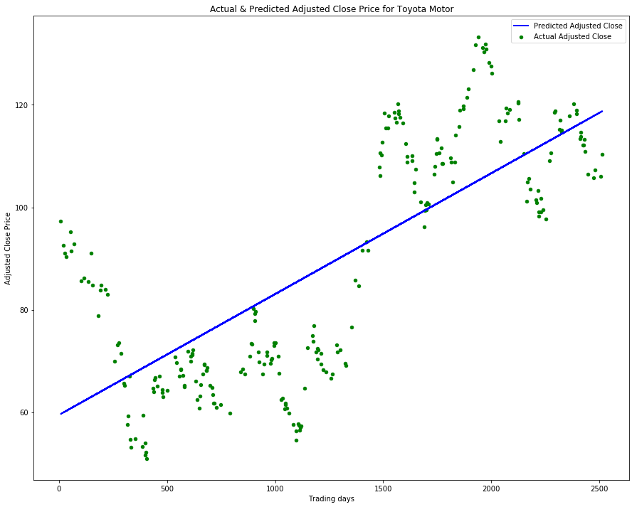

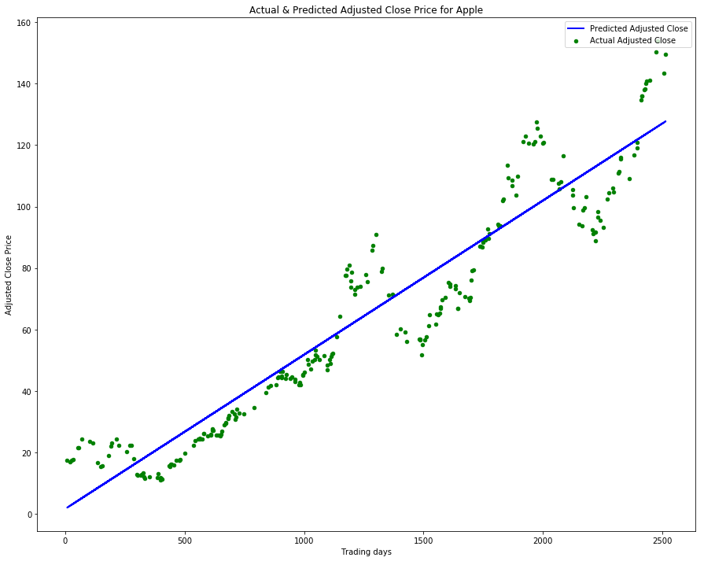

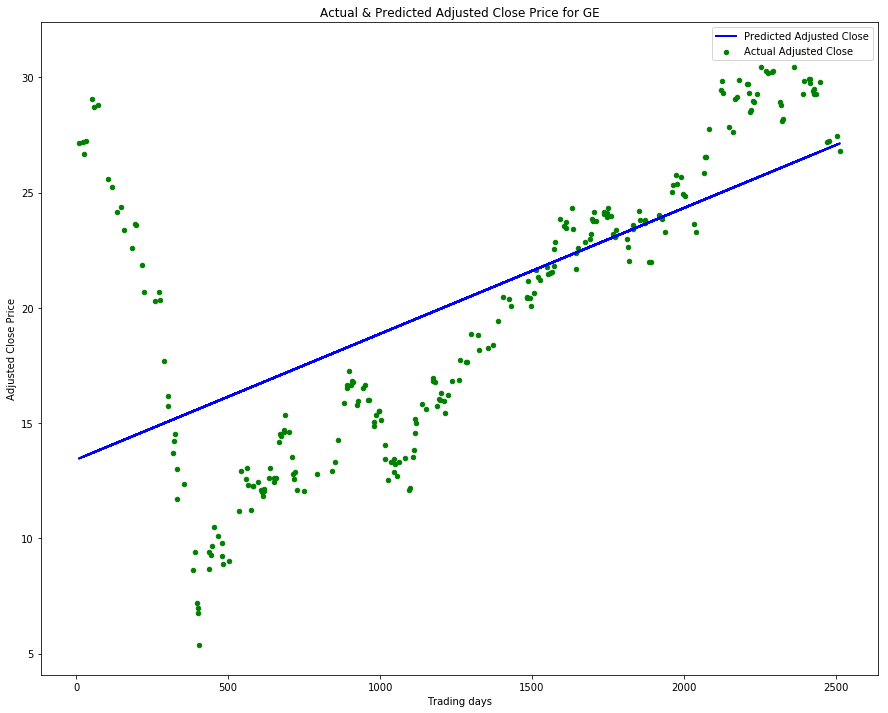

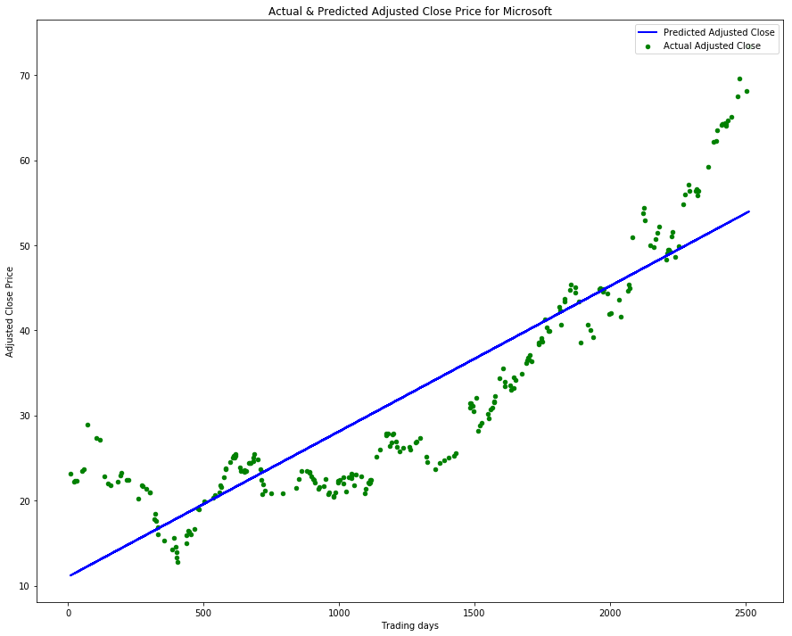

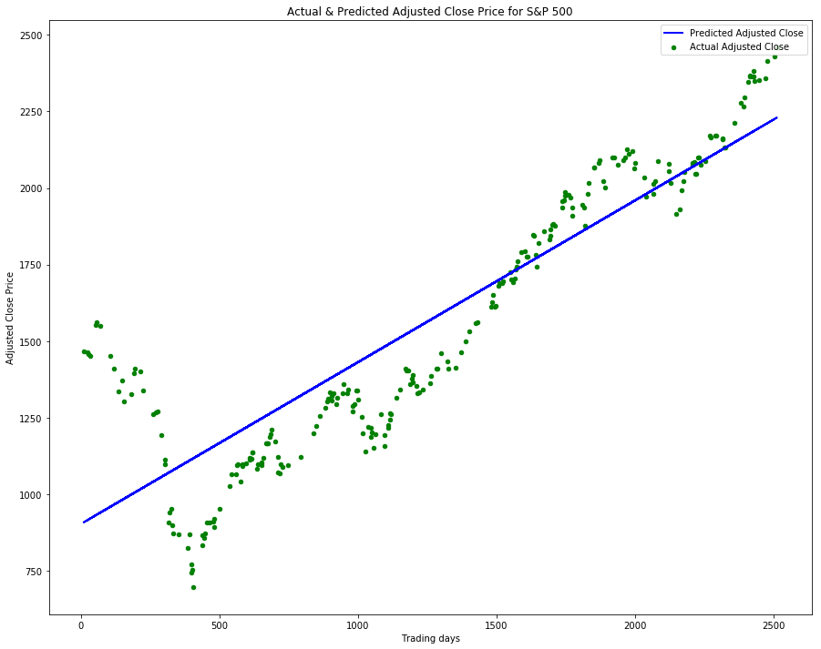

### Linear Regression results (MSE/RMSE)

Toyota (MSE):  224.08264758<br />
Toyota (RMSE):  14.9693903543<br />
Apple (MSE):  139.563948246<br />
Apple (RMSE):  14.9693903543<br />
GE (MSE):  21.4913114234<br />
GE (RMSE):  14.9693903543<br />
Microsoft (MSE):  37.4523711689<br />
Microsoft (RMSE):  14.9693903543<br />
S&P 500 (MSE):  37539.2002769<br />
S&P 500 (RMSE):  14.9693903543<br />

**The solution - LSTM model**

First implementation of LSTM model follows.

```py
# LSTM Model parameters, I chose
batch_size = 1            # Batch size
nb_epoch = 1              # Epoch
seq_len = 30              # 30 sequence data
loss='mean_squared_error' # Since the metric is MSE/RMSE
optimizer = 'rmsprop'     # Recommended optimizer for RNN
activation = 'linear'     # Linear activation
input_dim = 1             # Input dimension
output_dim = 30           # Output dimension

# Get Adjusted Close price and split the data
adj_closes = load_adj_close(csv_file)
X_train_, y_train_, X_test_, y_test_ = load_data_split_train_test(adj_closes, seq_len, True)

# Initialize Sequential, which is a linear stack layer
model = Sequential()

# Add a LSTM layer with the input dimension is 1 and the output dimension is 50
# The output is not fed into next layer
model.add(LSTM(
    input_dim=input_dim,
    output_dim=output_dim,
    return_sequences=False))

# Add Dense layer to aggregate the data from the prediction vector into a single value
model.add(Dense(
    output_dim=1))

# Add Linear Activation function
model.add(Activation(activation))

# Compile the model with MSE loss and RMSprop optimiser, since this is recommended for RNN
start = time.time()
model.compile(loss=loss, optimizer=optimizer)

# Train the model
model.fit(
    X_train_,
    y_train_,
    batch_size=batch_size,
    nb_epoch=nb_epoch,
    validation_split=0.05)

# Predict
testPredict = model.predict(X_test_, batch_size=batch_size)
score = model.evaluate(X_test_, y_test_, batch_size=batch_size, verbose=0)

# Result (MSE adn RMSE)
TM_MSE = score
TM_RMSE = math.sqrt(score)
```

### Baisc LSTM plot

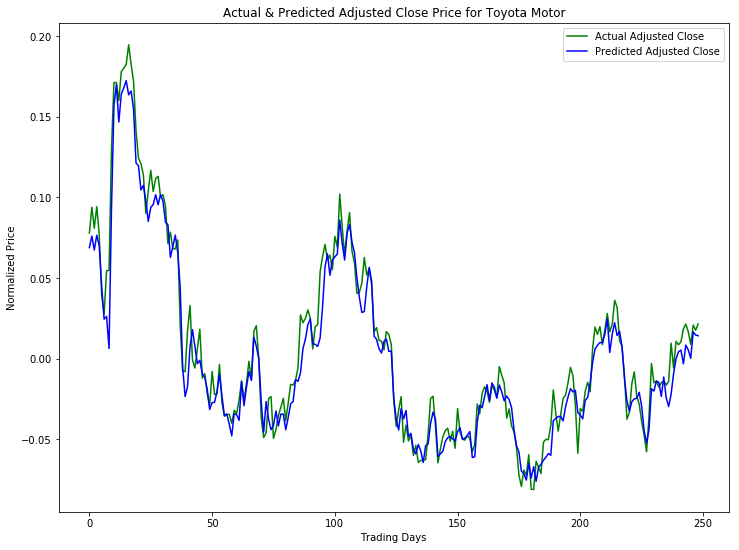

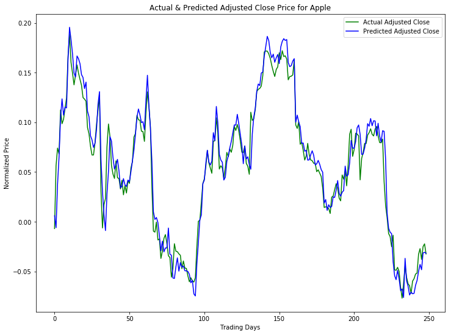

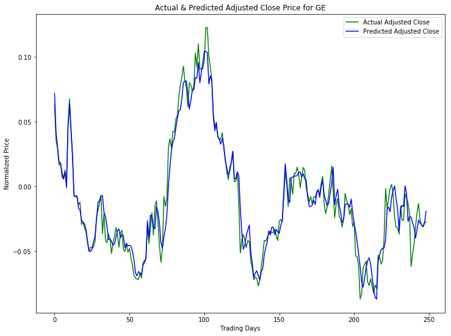

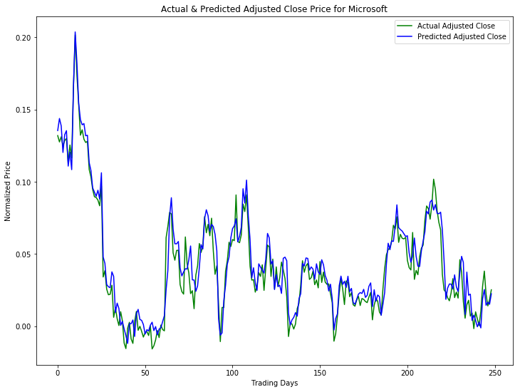

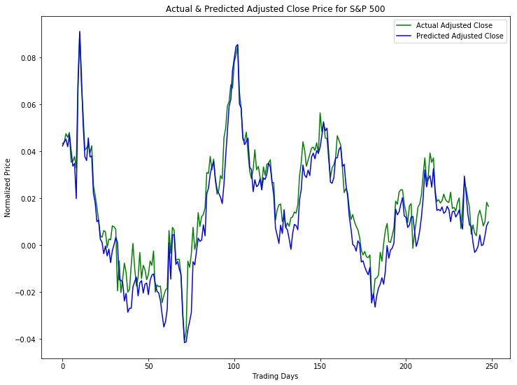

### Basic LSTM results (MSE/RMSE)

Toyota (MSE):  0.000143752868767<br />
Toyota (RMSE):  0.0119896984435<br />
Apple (MSE):  0.000206062711005<br />
Apple (RMSE):  0.0143548845695<br />
GE (MSE):  0.000102261837848<br />
GE (RMSE):  0.010112459535<br />
Microsoft (MSE):  0.000104691520582<br />
Microsoft (RMSE):  0.0102318874398<br />
S&P 500 (MSE):  6.13824635252e-05<br />
S&P 500 (RMSE):  0.00783469613484<br />

### Refinement

I experimented by playing with parameters and adding and dropping layers to see 
which one produces better results (Lower MSE / RMSE score). I experimented with just Toyota datasets since it is time consuming and does not really make sense to apply the same algorithm and the technique to all the datasets (Apple, GE, Microsoft, S&P 500) to see the effectiveness. One dataset is enough.

**Experiemnt-1**

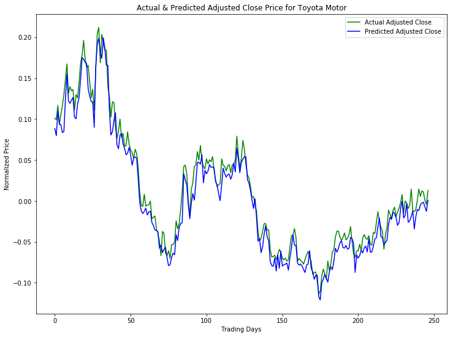

**Experiemnt-2**

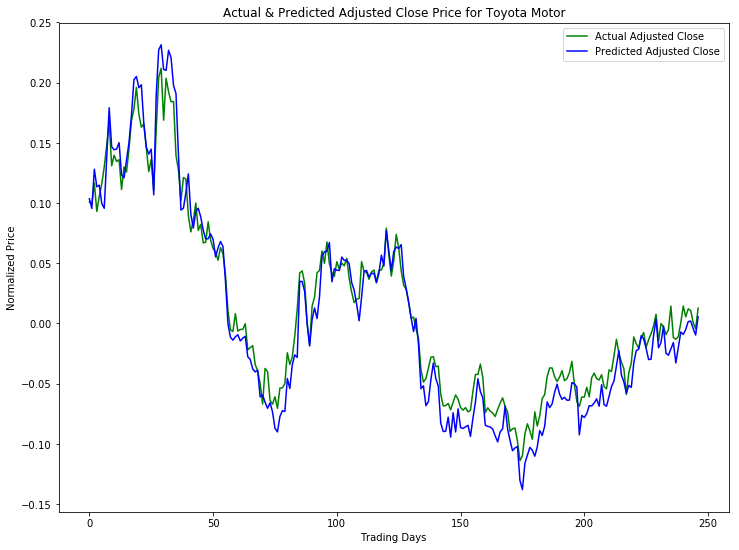

**Experiemnt-3**

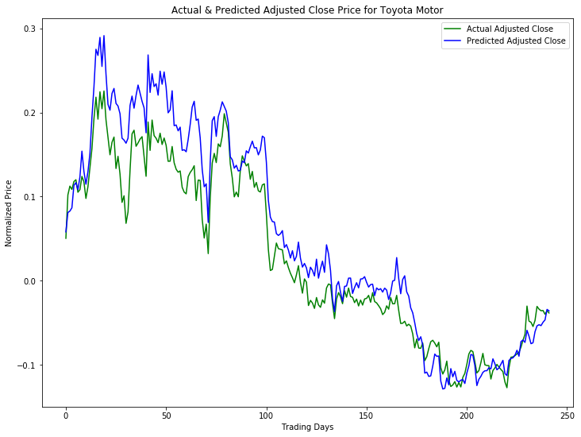

**Experiemnt-4**

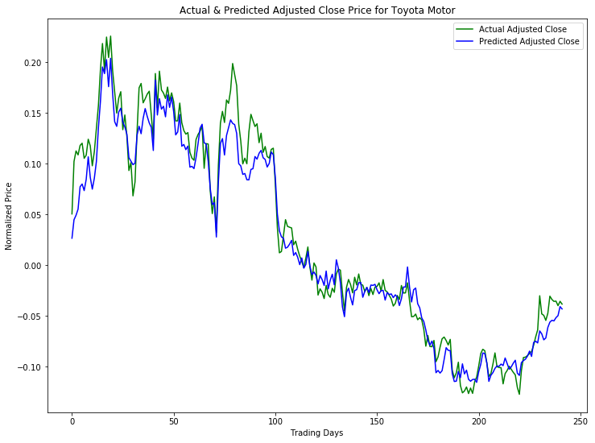

**Experiemnt-5**

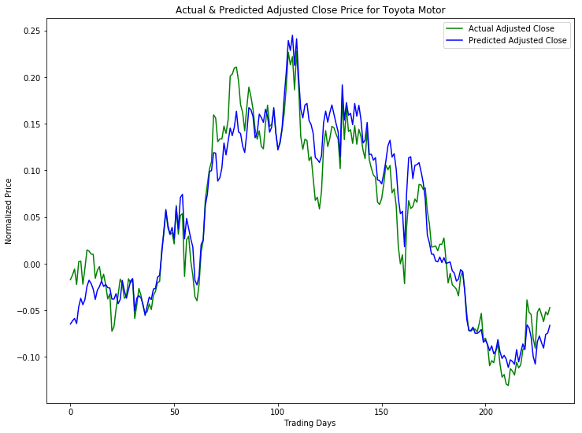

**Experiemnt-6**


**Experiemnt-7**

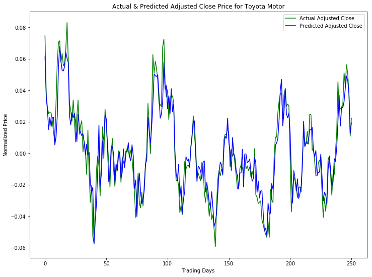


S&P 500 (RMSE):  0.00723791624904

## IV. Results

### Model Evaluation and Validation

After the refinement (experiemnting with parameters), the final model predicts with higher accuracy than the first basic LSTM model, as well as the regression model.

### Final LSTM model plot


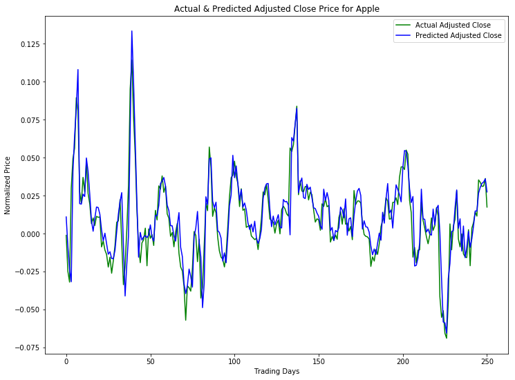

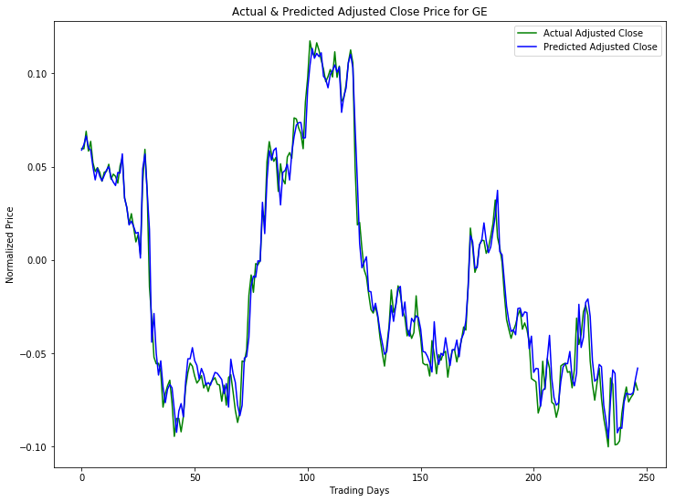

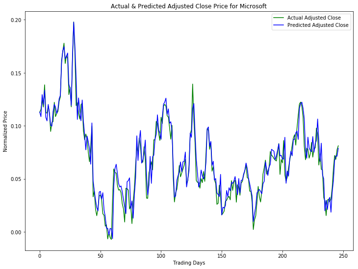

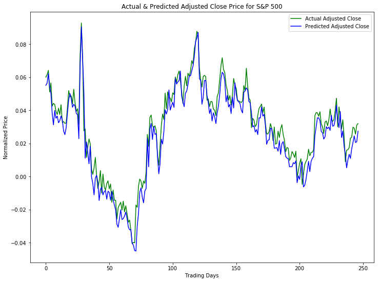

### Final LSTM model results

Toyota (MSE):  0.000131006485125
Toyota (RMSE):  0.0114458064428
Apple (MSE):  0.000140182430504
Apple (RMSE):  0.0118398661523
GE (MSE):  7.87504528992e-05
GE (RMSE):  0.00887414519259
Microsoft (MSE):  9.82947370459e-05
Microsoft (RMSE):  0.00991437022941
S&P 500 (MSE):  5.23874316281e-05

TODO-5: place images of plots and put the final results, 
how it is valid?
how justified for unseen data?
params appropriate?


### Justification

Compared to the simple linear regression model (benchmark model), LSTM model (solution model) predicts better.

TODO-6: comparison, significant enough to solve the original issue?

## V. Conclusion

### Reflection

TODO-8

I realized that how powerful Deep Learning is. By using the library (Keras in this project, but there are more like Tensorflow) to implement it with a few lines of code.

The final model improves the result but the time it took is much greater than the basic model.


In this section, you will summarize the entire end-to-end problem solution and discuss one or two particular aspects of the project you found interesting or difficult. You are expected to reflect on the project as a whole to show that you have a firm understanding of the entire process employed in your work. Questions to ask yourself when writing this section:
- _Have you thoroughly summarized the entire process you used for this project?_
- _Were there any interesting aspects of the project?_
- _Were there any difficult aspects of the project?_
- _Does the final model and solution fit your expectations for the problem, and should it be used in a general setting to solve these types of problems?_

### Improvement

TODO-9
I strongly belive there are better solutions with less time consumption than I did. This is implemented with Python 2.7, but I believe that if I use a compiled language like C++ or Go, it will be much faster than Python.

In this section, you will need to provide discussion as to how one aspect of the implementation you designed could be improved. As an example, consider ways your implementation can be made more general, and what would need to be modified. You do not need to make this improvement, but the potential solutions resulting from these changes are considered and compared/contrasted to your current solution. Questions to ask yourself when writing this section:
- _Are there further improvements that could be made on the algorithms or techniques you used in this project?_
- _Were there algorithms or techniques you researched that you did not know how to implement, but would consider using if you knew how?_
- _If you used your final solution as the new benchmark, do you think an even better solution exists?_

### References

- http://fortune.com/2017/03/30/blackrock-robots-layoffs-artificial-intelligence-ai-hedge-fund/
- https://seekingalpha.com/article/4083754-superior-portfolio-roi-artificially-intelligent-algorithms
- http://colah.github.io/posts/2015-08-Understanding-LSTMs/
- http://machinelearningmastery.com/time-series-prediction-with-deep-learning-in-python-with-keras/
- http://machinelearningmastery.com/time-series-prediction-lstm-recurrent-neural-networks-python-keras/
- http://www.jakob-aungiers.com/articles/a/LSTM-Neural-Network-for-Time-Series-Prediction
- https://www.freelancermap.com/freelancer-tips/11865-trend-prediction-with-lstm-rnns-using-keras-tensorflow-in-3-steps]
- https://medium.com/@TalPerry/deep-learning-the-stock-market-df853d139e02
- http://www.naun.org/main/NAUN/mcs/2017/a042002-041.pdf
- https://stats.stackexchange.com/questions/189652/is-it-a-good-practice-to-always-scale-normalize-data-for-machine-learning
- https://stackoverflow.com/questions/42014425/neural-networks-what-does-the-activation-layer-in-neural-networks-do
- https://www.youtube.com/watch?v=ftMq5ps503w
- Machine Learning for Trading: https://www.udacity.com/course/machine-learning-for-trading--ud501
- Time Series Forecasting https://www.udacity.com/course/time-series-forecasting--ud980